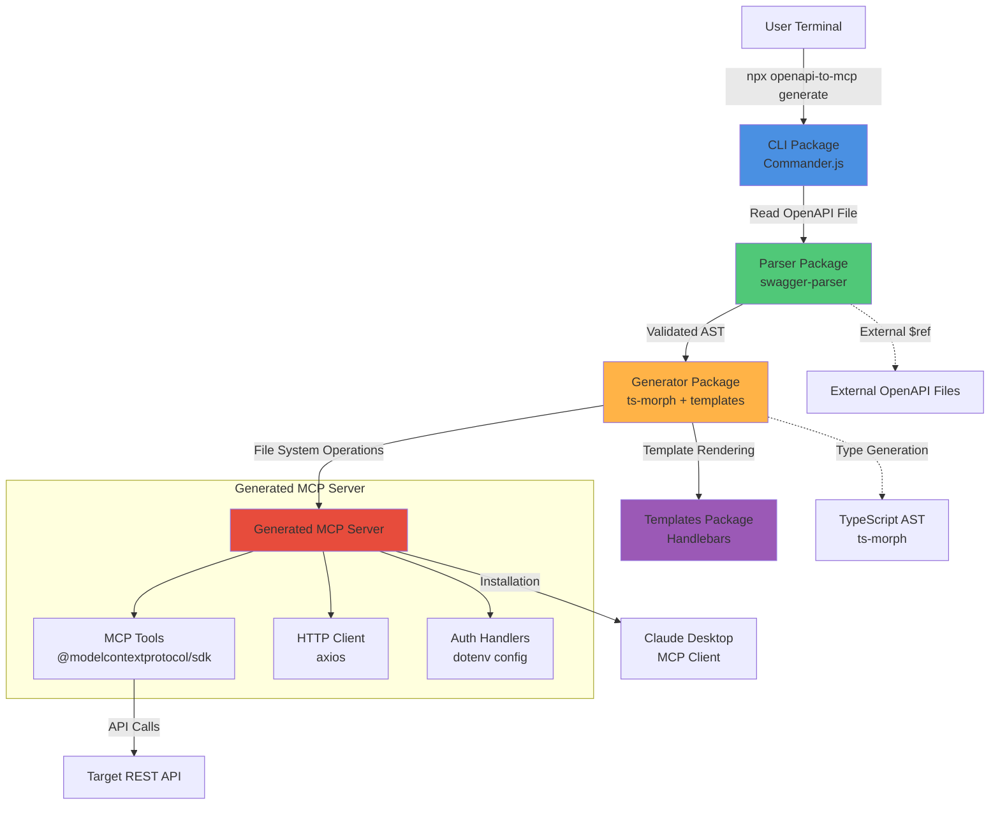

# OpenAPI-to-MCP Generator Architecture Document

**Version:** 1.0
**Status:** ✅ Ready for Development
**Last Updated:** 2025-01-03

---

## Table of Contents

1. [Introduction](#introduction)
2. [High-Level Architecture](#high-level-architecture)
3. [Tech Stack](#tech-stack)
4. [Components](#components)
5. [External APIs](#external-apis)
6. [Source Tree](#source-tree)
7. [Infrastructure and Deployment](#infrastructure-and-deployment)
8. [Error Handling Strategy](#error-handling-strategy)
9. [Coding Standards](#coding-standards)
10. [Test Strategy](#test-strategy)
11. [Security](#security)
12. [Related Documents](#related-documents)

---

## Introduction

This document outlines the overall project architecture for **OpenAPI-to-MCP Generator**, including backend systems, shared services, and CLI tool design. Its primary goal is to serve as the guiding architectural blueprint for AI-driven development, ensuring consistency and adherence to chosen patterns and technologies.

**Project Type:** Backend CLI Tool (no frontend/UI components)

**Core Technology Stack:** TypeScript 5.3.3 (strict mode), Node.js 20.11.0 LTS, pnpm 8.15.1 workspaces

### Relationship to Other Architecture Documents

This is the **definitive architecture document** for the OpenAPI-to-MCP Generator. Supporting documents provide deeper detail on specific aspects:

- **[Data Models](./architecture-data-models.md)** - Detailed data model specifications and transformation pipeline
- **[Workflows](./architecture-workflows.md)** - Sequence diagrams and interaction patterns
- **[Validation Report](./architecture-validation.md)** - Architecture checklist results and readiness assessment

All architecture documents are located in `/docs/architecture/`.

### Starter Template or Existing Project

**N/A - Greenfield Custom Monorepo**

This project is a **greenfield build** without reliance on a pre-existing starter template. The architecture is intentionally custom-designed to support a specialized monorepo structure optimized for code generation tooling.

**Rationale for Not Using Starter Template:**

1. **Specialized Requirements**: CLI code generator with multi-package architecture doesn't match standard application templates
2. **Monorepo Tooling**: We need workspace management (pnpm workspaces) which most starters don't provide pre-configured
3. **Build Complexity**: Hybrid template-based + AST manipulation code generation requires custom build pipelines
4. **Learning Curve vs Flexibility**: Starting from scratch with well-defined tooling provides better control

**Manual Setup Required:**
- Monorepo workspace configuration (pnpm-workspace.yaml)
- TypeScript strict mode configuration across packages
- Custom build pipeline for CLI bundling (tsup)
- Integration testing infrastructure

### Change Log

| Date | Version | Description | Author |
|------|---------|-------------|--------|
| 2025-01-03 | 1.0 | Initial architecture document | Winston (Architect Agent) |

---

## High-Level Architecture

### Technical Summary

The OpenAPI-to-MCP Generator employs a **modular CLI pipeline architecture** with clear separation between parsing, transformation, and code generation concerns. The system uses a **monorepo structure** with four specialized packages (CLI, Parser, Generator, Templates) that collaborate through well-defined interfaces to transform OpenAPI 3.0 specifications into production-ready TypeScript MCP servers.

**Core Technology Choices**: TypeScript 5.3.3 with strict mode for type safety, Node.js 18+ for MCP SDK compatibility, and a hybrid code generation approach combining template-based boilerplate with AST manipulation for dynamic type generation. The architecture prioritizes **developer experience** (single-command generation), **code quality** (100% TypeScript compilation success), and **AI optimization** (smart filtering for 200+ method APIs).

**Architectural Alignment with PRD Goals**: The pipeline design directly supports the primary goal of <10-minute time-to-first-success by minimizing user configuration requirements and maximizing generation automation. The modular package structure enables independent testing and future extensibility (plugin architecture for custom generators) while maintaining simplicity for MVP delivery.

### High-Level Overview

**1. Architectural Style: Modular Monolith with Pipeline Pattern**

The system follows a **unidirectional data flow pipeline**:

```
OpenAPI Input → Parser → Normalized AST → Generator → MCP Server Code → File System
```

Each stage is encapsulated in a dedicated package with single responsibility:
- **Parser**: Validates and normalizes OpenAPI documents
- **Generator**: Transforms AST into TypeScript code
- **CLI**: Orchestrates the pipeline and handles user interaction
- **Templates**: Provides reusable code generation patterns

**2. Repository Structure: Monorepo**

```
openapi-to-mcp/
├── packages/
│   ├── cli/              # Command-line interface
│   ├── parser/           # OpenAPI 3.0 parsing
│   ├── generator/        # Code generation engine
│   └── templates/        # Boilerplate templates
├── examples/             # Real-world test cases
├── docs/                 # Architecture + API docs
└── tests/                # Cross-package integration tests
```

**Package Manager**: pnpm workspaces (8.15.1)

**Rationale:**
- Simplifies dependency management and versioning
- Enables code sharing between packages
- Single CI/CD pipeline for all components
- Easier for contributors (one repo to clone)

**3. Service Architecture: Modular Monolith**

Not microservices - all packages deployed together as a single CLI tool. This matches PRD requirements:
- Single npm package distribution
- Shared TypeScript configuration
- Unified versioning and release process
- Cross-package type safety

**4. Primary Data Flow**

```
User Command (CLI)
  ↓
OpenAPI File Read
  ↓
Parser: Validation + $ref Resolution + Normalization
  ↓
Normalized AST (JSON structure)
  ↓
Generator: Template Rendering + AST→TypeScript Types + File Creation
  ↓
MCP Server Output (package.json, src/, README.md, .env.example)
```

**5. Key Architectural Decisions**

| Decision | Rationale | Trade-off |
|----------|-----------|-----------|
| **Monorepo over Polyrepo** | Shared tooling, single CI/CD, easier development | More complex workspace setup |
| **Pipeline over Event-Driven** | Synchronous generation fits CLI UX (immediate feedback) | Less extensibility than pub/sub |
| **Templates + AST Hybrid** | Templates for boilerplate speed, AST for type precision | Two code generation systems to maintain |
| **No Database** | Stateless CLI tool - no persistent data needed | Can't cache parsed OpenAPI docs across runs |
| **Synchronous Processing** | Aligns with CLI UX (wait for completion) | No parallel processing of multiple files |

### High-Level Project Diagram



### Architectural and Design Patterns

**1. Pipeline Pattern (Data Transformation)**
- **Description**: Sequential stages transform OpenAPI → AST → TypeScript code
- **Implementation**: CLI orchestrates Parser → Generator with clear stage boundaries
- **Rationale**: Matches natural data flow, enables testing at each stage, aligns with NFR1-2

**2. Repository Pattern (Code Generation Abstraction)**
- **Description**: Generator package abstracts different generation strategies (templates vs AST)
- **Implementation**: `ICodeGenerator` interface with `TemplateGenerator` and `ASTGenerator` implementations
- **Rationale**: Future-proofs for multiple output formats (JavaScript, Python MCP servers)

**3. Template Method Pattern (MCP Server Generation)**
- **Description**: Define skeleton of MCP server structure, allow customization per auth type
- **Implementation**: Base template with extension points for auth interceptors, tool registration
- **Rationale**: Reduces code duplication across auth schemes (API Key, Bearer, Basic share 90% structure)

**4. Strategy Pattern (Authentication Handlers)**
- **Description**: Different auth strategies implement common `IAuthHandler` interface
- **Implementation**: Generator selects strategy based on OpenAPI `securitySchemes`
- **Rationale**: Extensible to OAuth2 (post-MVP) without modifying core generator

**5. Builder Pattern (CLI Argument Parsing)**
- **Description**: Construct complex CLI configuration from user flags
- **Implementation**: Commander.js options builder with validation and defaults
- **Rationale**: Clear separation between argument parsing and business logic

**6. Facade Pattern (Parser Package API)**
- **Description**: Simple `parseOpenAPI(filePath)` hides complexity of validation + $ref resolution
- **Implementation**: Parser package exports single entry point wrapping swagger-parser
- **Rationale**: Reduces coupling - Generator doesn't need to know about OpenAPI internals

---

## Tech Stack

⚠️ **CRITICAL SECTION**: This table is the **single source of truth** for all technology decisions.

### Cloud Infrastructure

**Provider:** N/A (CLI Tool - No Cloud Deployment)

**Key Services:** None for MVP

**Distribution Infrastructure:**
- **npm Registry**: Primary distribution channel for CLI package
- **GitHub**: Repository hosting, CI/CD via GitHub Actions
- **CDN**: npm's built-in CDN for package distribution

**Deployment Regions:** Global via npm registry CDN

### Technology Stack Table

| Category | Technology | Version | Purpose | Rationale |
|----------|-----------|---------|---------|-----------|
| **Language** | TypeScript | 5.3.3 | Primary development language | Strict typing prevents runtime errors, excellent tooling |
| **Runtime** | Node.js | 20.11.0 LTS | JavaScript runtime | MCP SDK requires ≥18.0.0, v20 LTS stable through 2026 |
| **Package Manager** | pnpm | 8.15.1 | Monorepo workspace management | 30-50% faster installs, strict dependency resolution |
| **CLI Framework** | Commander.js | 11.1.0 | Command-line argument parsing | Battle-tested, excellent TypeScript support |
| **OpenAPI Parser** | @apidevtools/swagger-parser | 10.1.0 | OpenAPI validation + $ref resolution | De-facto standard, handles external refs |
| **Template Engine** | Handlebars | 4.7.8 | Boilerplate code generation | Logic-less templates, maintainable |
| **AST Manipulation** | ts-morph | 21.0.1 | TypeScript code generation | High-level TypeScript AST API |
| **HTTP Client (Generated)** | axios | 1.6.7 | API requests in generated servers | Interceptor support for auth |
| **MCP SDK (Generated)** | @modelcontextprotocol/sdk | 0.5.0 | MCP protocol implementation | Official Anthropic SDK |
| **Config Management (Generated)** | dotenv | 16.4.1 | Environment variable loading | Industry standard |
| **Testing Framework** | Vitest | 1.2.0 | Unit + integration testing | Native ESM support, 2-5x faster than Jest |
| **Linter** | ESLint | 8.56.0 | Code quality enforcement | Industry standard |
| **Formatter** | Prettier | 3.2.4 | Code formatting | Opinionated, zero-config |
| **CI/CD Platform** | GitHub Actions | N/A | Automated testing and publishing | Free for open source |
| **Documentation** | MkDocs Material | 9.5.6 | Documentation site generation | Beautiful developer docs |
| **Input Validation** | Zod | 3.22.4 | TypeScript-first schema validation | Type-safe validation |
| **License** | MIT | N/A | Open source license | Permissive, maximizes adoption |

---

## Components

> **See also**: [Data Models](./architecture-data-models.md) for detailed model specifications and [Workflows](./architecture-workflows.md) for component interaction sequences.

### Component 1: CLI Package (`packages/cli/`)

**Responsibility:** Command-line interface orchestration, user interaction, and pipeline coordination.

**Key Interfaces:**
- `generate(openapiPath: string, options: GenerateOptions): Promise<GenerationResult>`
- `validateOptions(options: RawOptions): GenerateOptions | ValidationError`
- `displayProgress(stage: PipelineStage, progress: number): void`
- `handleError(error: Error): ExitCode`

**Dependencies:**
- **Internal**: `@openapi-to-mcp/parser`, `@openapi-to-mcp/generator`
- **External**: `commander@11.1.0`, `ora@8.0.1`, `chalk@5.3.0`

**Technology Stack:**
- TypeScript 5.3.3 (compiled to ESM)
- Bundled with tsup 8.0.1 into single executable

**Internal Structure:**
```
packages/cli/
├── src/
│   ├── cli.ts              # Commander.js setup
│   ├── commands/
│   │   └── generate.ts     # Generate command implementation
│   ├── ui/
│   │   ├── progress.ts     # Progress indicators
│   │   └── errors.ts       # Error formatting
│   ├── validation/
│   │   └── options.ts      # CLI argument validation
│   └── types.ts
├── __tests__/
└── package.json
```

### Component 2: Parser Package (`packages/parser/`)

**Responsibility:** OpenAPI 3.0 validation, `$ref` resolution, schema normalization, and transformation.

**Key Interfaces:**
- `parseOpenAPI(filePath: string): Promise<ParsedOpenAPI>`
- `validateSchema(document: unknown): ValidationResult`
- `resolveReferences(document: OpenAPIDocument): Promise<OpenAPIDocument>`
- `normalizeOperations(document: OpenAPIDocument): NormalizedOperation[]`

**Dependencies:**
- **External**: `@apidevtools/swagger-parser@10.1.0`, `openapi-types@12.1.3`

**Internal Structure:**
```
packages/parser/
├── src/
│   ├── index.ts
│   ├── parser.ts
│   ├── validators/
│   ├── normalizers/
│   ├── resolvers/
│   ├── extractors/
│   ├── errors.ts
│   └── types.ts
├── __tests__/
│   └── fixtures/
└── package.json
```

### Component 3: Generator Package (`packages/generator/`)

**Responsibility:** Code generation orchestration, template rendering, TypeScript AST manipulation.

**Key Interfaces:**
- `generateMCPServer(parsed: ParsedOpenAPI, options: GeneratorOptions): Promise<GeneratedMCPServer>`
- `generateTypes(interfaces: TypeScriptInterface[]): string`
- `renderTemplate(templateName: string, data: any): string`

**Dependencies:**
- **Internal**: `@openapi-to-mcp/templates`
- **External**: `ts-morph@21.0.1`, `handlebars@4.7.8`, `fs-extra@11.2.0`

**Internal Structure:**
```
packages/generator/
├── src/
│   ├── index.ts
│   ├── generator.ts
│   ├── strategies/
│   ├── renderers/
│   ├── type-mapper/
│   ├── file-writer/
│   ├── validation/
│   └── types.ts
└── package.json
```

### Component 4: Templates Package (`packages/templates/`)

**Responsibility:** Handlebars templates for MCP server boilerplate.

**Internal Structure:**
```
packages/templates/
├── src/
│   ├── index.ts
│   ├── mcp-server/
│   ├── auth/
│   ├── http/
│   ├── config/
│   ├── docs/
│   └── types.ts
└── package.json
```

---

## External APIs

### External API 1: npm Registry API

**Purpose:** Package publication and distribution

**Base URL:** `https://registry.npmjs.org/`

**Authentication:** npm token (CI/CD only)

**Rate Limits:** 150 requests/hour authenticated

**Integration Notes:**
- Publishing Flow: GitHub Actions → npm publish on git tag
- Provenance: npm provenance enabled for supply chain security

### External API 2: MCP SDK

**Purpose:** Core MCP protocol implementation for generated servers

**Documentation:** https://github.com/anthropics/model-context-protocol

**Integration Notes:**
- Version Constraint: Requires Node.js ≥18.0.0
- Breaking Changes: Pin specific version in generated package.json

### External API 3: OpenAPI External $refs

**Purpose:** Fetch external OpenAPI schema files

**Authentication:** Public URLs only (MVP)

**Integration Notes:**
- Caching: In-memory cache per CLI run
- Security: HTTPS URLs only
- Timeout: 10-second timeout per fetch

### External API 4: GitHub API

**Purpose:** CI/CD workflows and repository management

**Base URL:** `https://api.github.com/`

**Rate Limits:** 5000 requests/hour authenticated

**Integration Notes:**
- Automated Publishing: Git tag → GitHub Actions → npm publish
- Dependabot: Automated dependency PRs

---

## Source Tree

Complete project folder structure:

```
openapi-to-mcp/
├── .github/workflows/
│   ├── test.yml
│   ├── publish.yml
│   └── dependabot.yml
├── packages/
│   ├── cli/
│   ├── parser/
│   ├── generator/
│   └── templates/
├── examples/
│   ├── petstore/
│   ├── github-api/
│   └── ozon-performance/
├── tests/
│   ├── integration/
│   ├── e2e/
│   └── fixtures/
├── docs/
│   ├── architecture.md                 # THIS DOCUMENT
│   ├── architecture-data-models.md
│   ├── architecture-workflows.md
│   ├── architecture-validation.md
│   └── [other docs]
├── scripts/
├── .vscode/
├── pnpm-workspace.yaml
├── package.json
├── tsconfig.json
├── vitest.config.ts
└── README.md
```

---

## Infrastructure and Deployment

### Deployment Strategy

**Strategy:** Continuous Deployment via Git Tags

**Deployment Flow:**
```
Developer → Git Tag (v1.0.0) → GitHub Actions → npm publish → Global Availability
```

**Quality Gates:**
1. All unit tests pass (80%+ coverage)
2. TypeScript compilation successful
3. Generated code compiles (NFR6: 100%)
4. Version matches git tag

**Deployment Steps:**
1. Checkout code
2. Setup Node.js 20.x + pnpm 8.15.1
3. Run tests
4. Build packages
5. Publish to npm with provenance
6. Create GitHub Release
7. Deploy documentation

### Environments

**Development:** Local machines (Node.js 18+, pnpm 8.15.1)

**CI (GitHub Actions):** Matrix testing (Node 18/20/22, Ubuntu/macOS)

**Production:** npm Registry (global CDN)

### Rollback Strategy

**Primary Method:** npm deprecation + patch release

**RTO:** <2 hours from issue discovery to fixed version

```bash
npm deprecate @openapi-to-mcp/cli@1.0.0 "Security issue"
git tag v1.0.1 && git push --tags
```

---

## Error Handling Strategy

> **See also**: [Workflows](./architecture-workflows.md) for error recovery sequences.

### General Approach

**Error Model:** Typed errors with structured context

**Exception Hierarchy:**
```typescript
BaseError
├── CLIError (user-facing)
│   ├── ValidationError
│   ├── FileSystemError
│   └── UserInputError
├── InternalError
│   ├── ParserError
│   ├── GeneratorError
│   └── CompilationError
└── NetworkError
    ├── ExternalRefError
    └── RegistryError
```

### Logging Standards

**Library:** `debug` 4.3.4

**Namespaces:**
- `openapi-to-mcp:cli:*`
- `openapi-to-mcp:parser:*`
- `openapi-to-mcp:generator:*`

**Required Context:**
- Correlation ID (UUID)
- Never log credentials, OpenAPI contents, env vars

### Error Handling Patterns

**Retry Policy:**
- Exponential backoff (3 attempts, 1-10s delay)
- Circuit breaker: 5 failures → 30s timeout

**Data Consistency:**
- Atomic file writes (temp directory + rename)
- Rollback on failure

---

## Coding Standards

⚠️ **MANDATORY** for AI and human developers.

### Core Standards

**Languages:** TypeScript 5.3.3 (strict mode), Node.js ≥18.0.0

**Module System:** ESM only (`import`/`export`)

**Style:** ESLint 8.56.0 + Prettier 3.2.4

**Testing:** Vitest 1.2.0, ≥80% coverage

### Critical Rules

1. **Never use `console.log`** - Use `debug` library
2. **All async must have error handling** - Wrap in try-catch
3. **All file ops use absolute paths** - Use `path.resolve()`
4. **Never hardcode secrets** - Use `process.env`
5. **All generated TS must compile** - Run `tsc --noEmit` before write
6. **Sanitize operationIds** - Ensure valid TypeScript identifiers
7. **All errors must be typed** - Use custom error classes
8. **External $refs must be HTTPS** - Reject HTTP URLs
9. **Use `unknown` not `any`** - Force explicit type checking
10. **Avoid non-null assertions** - Use optional chaining

---

## Test Strategy

> **See also**: [Workflows](./architecture-workflows.md) for E2E scenarios.

### Testing Philosophy

**Approach:** TDD for critical paths (Epics 2-6)

**Coverage Goals:**
- Unit: ≥80% line coverage
- Integration: ≥70% workflows
- E2E: 100% commands

**Test Pyramid:**
```
         E2E (5%)
    Integration (25%)
  Unit Tests (70%)
```

### Test Types

**Unit Tests:** Vitest, `__tests__/`, AAA pattern, mock all external deps

**Integration Tests:** memfs, 10+ OpenAPI fixtures, cross-package validation

**E2E Tests:** Bash scripts, real CLI execution, generated server runtime

**Performance Tests:** <30s for 50 methods, <2min for 300 methods

---

## Security

⚠️ **MANDATORY** security requirements.

### Input Validation

**Library:** Zod 3.22.4

**Rules:**
1. All external inputs validated before processing
2. Whitelist approach over blacklist
3. Sanitize operationIds for code injection prevention

### Authentication

**CLI:** N/A (local tool)

**Generated Servers:** Environment variables only, never hardcoded

### Secrets Management

**Development:** `.env` files (in `.gitignore`)

**Code Requirements:**
1. NEVER hardcode secrets
2. No secrets in logs/errors
3. Generated `.gitignore` excludes `.env`

### API Security

**HTTPS Enforcement:** External $refs must use HTTPS

### Dependency Security

**Tools:** npm audit + Dependabot

**Update Policy:**
- Critical/High: Patch within 48h
- Medium: Patch within 2 weeks

**Dependency Pinning:** Exact versions only (no `^` or `~`)

### Security Testing

**SAST:** ESLint with `eslint-plugin-security`

**Checklist:**
```bash
npm audit --audit-level=moderate
npx eslint . --ext .ts
npx secretlint "**/*"
tsc --noEmit --strict
```

---

## Related Documents

### Core Documents
- **[PRD](./prd.md)** - Product Requirements Document
- **[Project Brief](./brief.md)** - Problem statement
- **[Epic Details](./prd-epics.md)** - User stories

### Architecture Supplements
- **[Data Models](./architecture-data-models.md)** - Data model specifications
- **[Workflows](./architecture-workflows.md)** - Sequence diagrams
- **[Validation Report](./architecture-validation.md)** - Checklist results

### Implementation Guides
- **[Getting Started](./getting-started.md)** - Quick start
- **[API Reference](./api-reference/)** - TypeDoc docs
- **[Error Codes](./errors/)** - Error documentation

---

**Document Version:** 1.0
**Architecture Status:** ✅ Ready for Development (92% checklist pass rate)
**Next Steps:** Proceed with Epic 1 (Foundation & Core CLI Infrastructure)

---

*Generated by Winston (Architect Agent) for the OpenAPI-to-MCP Generator project.*
