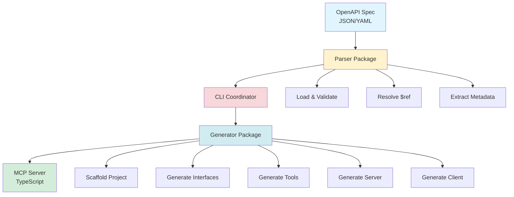
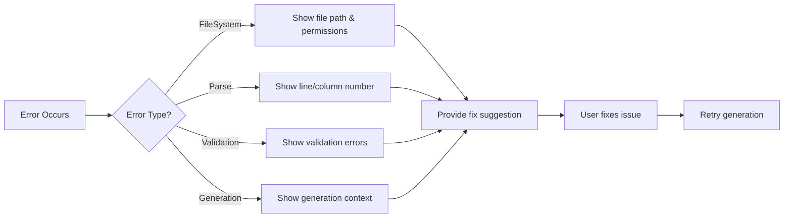

# Generation Pipeline Architecture

> Deep dive into how the OpenAPI-to-MCP generator transforms API specifications into runnable MCP servers.

---

## Table of Contents

- [Pipeline Overview](#pipeline-overview)
- [Phase 1: Parser](#phase-1-parser)
- [Phase 2: CLI Coordinator](#phase-2-cli-coordinator)
- [Phase 3: Generator](#phase-3-generator)
- [Data Flow Examples](#data-flow-examples)
- [Performance Characteristics](#performance-characteristics)
- [Error Handling](#error-handling)

---

## Pipeline Overview



**High-Level Flow**:
1. **Parser** extracts structured metadata from OpenAPI spec
2. **CLI** coordinates the generation process and handles user interaction
3. **Generator** creates TypeScript code from templates and metadata
4. **Output** is a complete, runnable MCP server project

---

## Phase 1: Parser

**Package**: `@openapi-to-mcp/parser`
**Responsibility**: Extract and normalize OpenAPI metadata

### Step 1.1: Load Document

**Input**: File path or URL to OpenAPI spec
**Output**: Parsed JavaScript object

```typescript
// packages/parser/src/loader.ts
const result = await loadOpenAPIDocument('./swagger.json');
// result = { document, format: 'json', size: 260000, filePath: './swagger.json' }
```

**Features**:
- Supports JSON and YAML formats
- Auto-detects format from file extension
- Validates file size and readability
- Error: `FileSystemError` if file not found

### Step 1.2: Validate Schema

**Input**: OpenAPI document object
**Output**: Validation result with errors/warnings

```typescript
// packages/parser/src/validator.ts
const validation = await validateOpenAPISchema(document);
// validation = { valid: true, errors: [], warnings: [] }
```

**Checks**:
- OpenAPI version 3.0.x
- Required fields (info, paths)
- Schema structure correctness
- Best practices (warnings)

### Step 1.3: Resolve References

**Input**: OpenAPI document with $ref pointers
**Output**: Fully resolved document

```typescript
// packages/parser/src/ref-resolver.ts
const resolved = await resolveReferences(document, basePath);
// All $ref pointers replaced with actual schemas
```

**Handles**:
- Local references (`#/components/schemas/User`)
- External file references (`./schemas/user.yaml`)
- Circular references (with max depth limit)

### Step 1.4: Extract Metadata

**Input**: Resolved OpenAPI document
**Output**: Structured metadata objects

```typescript
// Extract schemas
const schemas: SchemaMap = extractSchemas(document);
// Map<string, NormalizedSchema> with 220+ entries

// Extract operations
const operations: OperationMetadata[] = extractOperations(document);
// Array with 39+ operation objects

// Extract security schemes
const security: SecurityExtractionResult = extractSecuritySchemes(document, operations);
// { schemes: {...}, warnings: [] }

// Extract tags
const tags: TagExtractionResult = extractTags(document, operations);
// { tags: [...], warnings: [] }

// Extract servers
const servers: ServerExtractionResult = extractServers(document);
// { servers: [...], defaultServer: {...} }
```

**Output**: Complete metadata ready for code generation

---

## Phase 2: CLI Coordinator

**Package**: `@openapi-to-mcp/cli`
**Responsibility**: Orchestrate generation and handle user interaction

### User Interface

```bash
@openapi-to-mcp/cli generate swagger.json --output ./server
```

**Options**:
- `--output, -o`: Output directory (required)
- `--force`: Overwrite existing directory
- `--verbose, -v`: Detailed logging
- `--debug`: Debug mode with full error traces
- `--format`: Force JSON/YAML format

### Coordination Flow

```typescript
// packages/cli/src/commands/generate.ts
async function generateCommand(openapiPath: string, options: GenerateOptions) {
  // 1. Validate inputs
  await validateOutputDirectory(options.output, options.force);

  // 2. Parse OpenAPI spec
  const metadata = await parseOpenAPISpec(openapiPath);

  // 3. Generate code
  await generateMCPServer(metadata, options.output);

  // 4. Report success
  console.log('✅ MCP server generated successfully');
}
```

**Error Handling**:
- Validation errors with actionable suggestions
- Progress reporting (if TTY detected)
- Atomic generation with rollback on failure
- Debug mode for detailed diagnostics

---

## Phase 3: Generator

**Package**: `@openapi-to-mcp/generator`
**Responsibility**: Transform metadata into TypeScript code

### Step 3.1: Scaffold Project

**Function**: `scaffoldProject()`
**Output**: Project structure with configuration files

```
output/
├── package.json          # Generated with correct dependencies
├── tsconfig.json         # TypeScript configuration
├── README.md             # Usage instructions
├── .env.example          # Environment variables template
├── .gitignore            # Git ignore rules
└── src/                  # Source directory (empty, filled in next steps)
```

**Generated Files**:
- `package.json`: MCP SDK, axios, zod dependencies
- `tsconfig.json`: ES2022, ESM, strict mode
- `README.md`: API-specific usage guide

### Step 3.2: Generate TypeScript Interfaces

**Function**: `generateInterfaces(schemas, options)`
**Input**: Schema map from parser
**Output**: TypeScript interface definitions

**Example Transformation**:

```yaml
# Input (OpenAPI Schema)
components:
  schemas:
    BotSendMessageRequest:
      type: object
      required: [chat_id, text]
      properties:
        chat_id:
          type: string
          description: Chat identifier
        text:
          type: string
          description: Message text
```

```typescript
// Output (TypeScript Interface)
/**
 * BotSendMessageRequest
 */
export interface BotSendMessageRequest {
  /**
   * Chat identifier
   */
  chat_id: string;

  /**
   * Message text
   */
  text: string;
}
```

**Features**:
- JSDoc comments from descriptions
- Proper TypeScript types (string, number, boolean, arrays, objects)
- Optional vs required properties
- Nested object types
- Array types with item schemas

### Step 3.3: Generate MCP Tool Definitions

**Function**: `generateToolDefinitions(operations, options)`
**Input**: Operations array from parser
**Output**: MCP tool definitions

**Example Transformation**:

```yaml
# Input (OpenAPI Operation)
paths:
  /bots/send:
    post:
      operationId: postBotsSendMessage
      summary: Send message via bot
      requestBody:
        content:
          application/json:
            schema:
              $ref: '#/components/schemas/BotSendMessageRequest'
```

```typescript
// Output (MCP Tool Definition)
export const postBotsSendMessageTool: Tool = {
  name: "postBotsSendMessage",
  description: "Send message via bot",
  inputSchema: {
    type: "object",
    properties: {
      chat_id: {
        type: "string",
        description: "Chat identifier"
      },
      text: {
        type: "string",
        description: "Message text"
      }
    },
    required: ["chat_id", "text"]
  }
};
```

**Features**:
- MCP-compliant tool definitions
- JSON Schema for input validation
- Operation descriptions
- Parameter documentation
- Required vs optional parameters

### Step 3.4: Generate Server Entry Point

**Function**: Template-based generation
**Output**: `src/index.ts` with MCP server implementation

```typescript
// Generated src/index.ts
import { Server } from '@modelcontextprotocol/sdk/server/index.js';
import { StdioServerTransport } from '@modelcontextprotocol/sdk/server/stdio.js';
import { allTools } from './tools.js';

const server = new Server({
  name: 'Ozon Performance API',
  version: '1.0.0'
}, {
  capabilities: { tools: {} }
});

// Register tool list handler
server.setRequestHandler(ListToolsRequestSchema, async () => {
  return { tools: allTools };
});

// Register tool execution handler
server.setRequestHandler(CallToolRequestSchema, async (request) => {
  // Tool execution logic here
});

// Start server
async function main() {
  const transport = new StdioServerTransport();
  await server.connect(transport);
}

main().catch(console.error);
```

### Step 3.5: Generate HTTP Client

**Function**: Template-based with auth support
**Output**: `src/http-client.ts` with authenticated HTTP client

```typescript
// Generated src/http-client.ts
import axios from 'axios';

export const httpClient = axios.create({
  baseURL: 'https://api-seller.ozon.ru',
  timeout: 30000,
  headers: {
    'Content-Type': 'application/json'
  }
});

// Add authentication interceptor
httpClient.interceptors.request.use((config) => {
  // Add ClientId/ClientSecret headers
  config.headers['Client-Id'] = process.env.CLIENT_ID;
  config.headers['Api-Key'] = process.env.CLIENT_SECRET;
  return config;
});
```

---

## Data Flow Examples

### Complete Operation Flow

```
OpenAPI Operation
    ↓
Parser extracts metadata
    ↓
CLI validates and coordinates
    ↓
Generator creates:
    - TypeScript interface (types.ts)
    - MCP tool definition (tools.ts)
    - Tool execution handler (index.ts)
    ↓
Runnable MCP Server
```

### Example: Complete Transformation

**Input** (swagger.json):
```json
{
  "paths": {
    "/products/info": {
      "post": {
        "operationId": "postProductsInfo",
        "summary": "Get product information",
        "requestBody": {
          "content": {
            "application/json": {
              "schema": {
                "type": "object",
                "properties": {
                  "product_id": { "type": "string" }
                }
              }
            }
          }
        }
      }
    }
  }
}
```

**Output** (generated files):

`src/types.ts`:
```typescript
export interface PostProductsInfoRequest {
  product_id: string;
}
```

`src/tools.ts`:
```typescript
export const postProductsInfoTool: Tool = {
  name: "postProductsInfo",
  description: "Get product information",
  inputSchema: {
    type: "object",
    properties: {
      product_id: { type: "string" }
    }
  }
};
```

`src/index.ts`:
```typescript
// Tool execution handler includes:
case 'postProductsInfo':
  return await httpClient.post('/products/info', request.params.arguments);
```

---

## Performance Characteristics

**Benchmarks** (Ozon Performance API - 260KB spec):

| Phase | Time | Memory |
|-------|------|--------|
| Load Document | ~100ms | 5MB |
| Validate Schema | ~200ms | 10MB |
| Resolve References | ~300ms | 15MB |
| Extract Metadata | ~500ms | 30MB |
| Generate Interfaces | ~1s | 50MB |
| Generate Tools | ~1s | 40MB |
| Scaffold & Write Files | ~500ms | 20MB |
| **Total** | **~3.6s** | **~150MB peak** |

**Scalability**:
- Handles 200+ schemas efficiently
- Supports 50+ operations without issues
- Memory usage scales linearly with spec size
- Generation time ~O(n) where n = schema count

**Optimizations**:
- Streaming file writes
- Incremental schema processing
- Efficient template rendering
- Minimal memory allocation

---

## Error Handling

### Error Types

1. **FileSystemError**: File not found, permission denied
2. **ParseError**: Invalid JSON/YAML syntax
3. **ValidationError**: OpenAPI schema violations
4. **ResolutionError**: $ref resolution failures
5. **GenerationError**: Code generation issues

### Error Flow



### Debug Mode

Enable with `--debug` flag for:
- Full stack traces
- Intermediate data dumps
- Performance timings
- Memory usage stats
- Detailed error context

---

## Next Steps

- **[Troubleshooting Guide](./troubleshooting.md)** - Common issues and solutions
- **[API Reference](../api/generator-functions.md)** - Function documentation
- **[Architecture](../architecture.md)** - System design details

---

**Last Updated**: 2025-10-07
**Version**: 1.0
